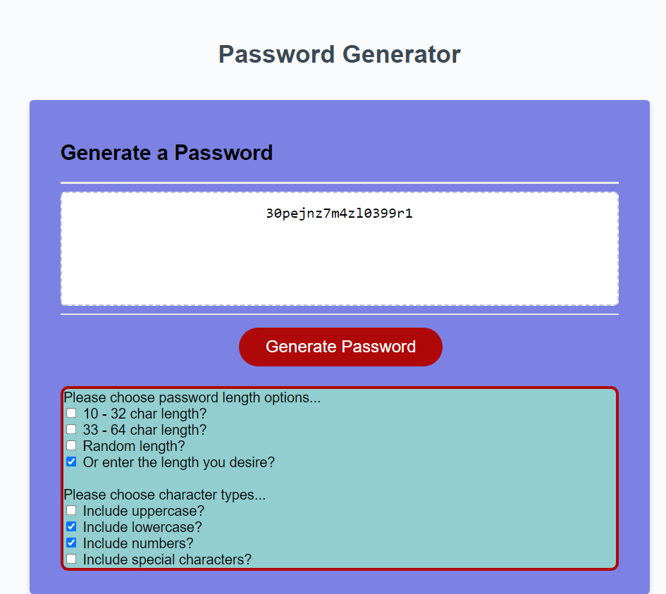

# Password Generator

This task implements a randomised password generator. The criteria for this include a 10-64 character length and 
choice character inputs. The allowed inputs include:

      * all lowercase letters (n, a, m, i, c, h, a, n, etc)
      * all uppercase letters (N, A, M, I, C, H, A, N, etc)
      * Numeric (1,2,3,4,5, etc)
      * Special characters ($,@,%,&,*, etc)

But not to worry, users will be guided by alerts and prompts to ensure your password specifications are correctly
intrepreted and your needs met.

## Installation

Visit the live website [here](https://enwokedi96.github.io/password-generator/).

## Usage

The screenshot of the webpage can be visualised below: 

The layout is quite simple. Before generating a password, users are required to pick one of the option under the password lengths and at least one 
for the character options. Once due procedures are followed, a unique password is generated and displayed on the screen.

The website can also be reloaded to visualised many other colors. The page is reset once reloaded and all prior options cleared.
    
## License

Link to license can be found [here](LICENSE.md).

